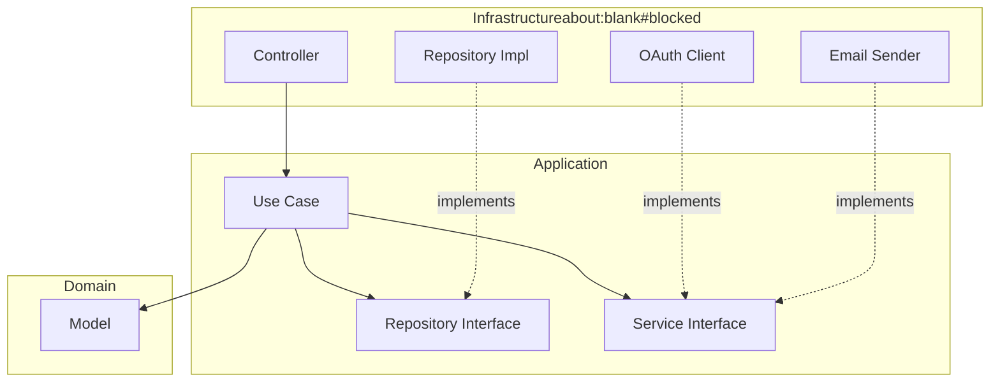

# Architecture & Standards — Identity Service Template

This document defines the strict development rules for any service built on this template.
**Goal:** Zero ambiguity about file locations, pragmatic Clean Architecture, and portfolio-grade rationale.

The *why* behind each major choice is documented as Architecture Decision Records in [`docs/adr/`](./docs/adr/).

---

## 📑 Table of Contents

- [Architecture \& Standards — Identity Service Template](#architecture--standards--identity-service-template)
  - [📑 Table of Contents](#-table-of-contents)
  - [1. Philosophy](#1-philosophy)
  - [2. Tech Stack](#2-tech-stack)
  - [3. Folder Structure](#3-folder-structure)
  - [4. The Three Layers](#4-the-three-layers)
    - [A. Domain — Why It's (Mostly) Pure](#a-domain--why-its-mostly-pure)
    - [B. Application — The Orchestration Layer](#b-application--the-orchestration-layer)
    - [C. Infrastructure — All The Adapters](#c-infrastructure--all-the-adapters)
  - [5. Use Case Pattern](#5-use-case-pattern)
  - [6. Error Handling](#6-error-handling)
    - [A. Two-Tier Exception Hierarchy](#a-two-tier-exception-hierarchy)
    - [B. Generic External Messages (Security Rule)](#b-generic-external-messages-security-rule)
    - [C. Response Shape](#c-response-shape)
  - [7. Authentication Flow](#7-authentication-flow)
    - [Access Tokens](#access-tokens)
    - [Refresh Tokens](#refresh-tokens)
    - [OAuth](#oauth)
    - [Password Reset](#password-reset)
  - [8. Naming Conventions](#8-naming-conventions)
  - [9. Golden Rules](#9-golden-rules)
  - [10. Configuration \& Secrets](#10-configuration--secrets)
  - [11. Persistence \& Migrations](#11-persistence--migrations)
  - [12. Observability](#12-observability)
    - [Logging](#logging)
  - [13. Testing Standards](#13-testing-standards)
    - [A. Naming (Backticks)](#a-naming-backticks)
    - [B. AAA Pattern (Single Act)](#b-aaa-pattern-single-act)
    - [C. Stack](#c-stack)
  - [14. ADR Index](#14-adr-index)

---

## 1. Philosophy

We follow **pragmatic Clean Architecture** — three layers, dependency inversion at boundaries, and deliberate deviations from the textbook when ceremony outweighs value.

* **Domain is the center.** Business entities and rules live here, and conceptually depend on nothing else. We accept JPA annotations as a deliberate tradeoff — see [ADR-0002](./docs/adr/0002-jpa-annotated-domain-entities.md).
* **Application orchestrates.** One use case per action. Interfaces for anything the use case doesn't own (repositories, external services).
* **Infrastructure adapts.** Controllers, JPA repositories, OAuth clients, email providers — everything that touches the outside world.



Dependency direction is strict: **Infrastructure → Application → Domain**. Nothing flows the other way.

---

## 2. Tech Stack

| Category          | Tool                             |
|:------------------|:---------------------------------|
| **Language**      | Kotlin 1.9+ (JDK 21)             |
| **Framework**     | Spring Boot 3.x                  |
| **Security**      | Spring Security 6                |
| **JWT**           | jjwt 0.12.x                      |
| **Database**      | PostgreSQL 18                    |
| **ORM**           | Spring Data JPA (Hibernate)      |
| **Migrations**    | Flyway (versioned SQL files)     |
| **Docs**          | Springdoc OpenAPI (Swagger UI)   |
| **Testing**       | JUnit 5 + MockK + Kotest asserts |
| **Observability** | Actuator + Micrometer Prometheus |
| **Logging**       | Logback + Logstash JSON encoder  |

---

## 3. Folder Structure

Three layers, flat inside each. This service is single-domain (identity), so we do **not** apply feature-first here — see [ADR-0001](./docs/adr/0001-pragmatic-clean-architecture.md).

```text
src/main/kotlin/com/template/identity/
├── IdentityApplication.kt
│
├── domain/                             # Pure business entities
│   ├── model/                          # User, OAuthAccount, RefreshToken, PasswordResetToken
│   └── exception/
│       └── DomainException.kt          # Sealed — invariant violations only
│
├── application/                        # Use cases + interfaces
│   ├── repository/                     # Interfaces the use cases call
│   ├── service/                        # Interfaces for external services (JWT, Email, OAuth)
│   ├── usecase/
│   │   ├── auth/                       # One class per endpoint action
│   │   └── user/
│   ├── dto/
│   │   ├── command/                    # Inputs to use cases
│   │   └── result/                     # Outputs from use cases
│   └── exception/
│       └── ApplicationException.kt     # Sealed — use-case-level errors
│
└── infrastructure/                     # All adapters
    ├── config/                         # @ConfigurationProperties, OpenApiConfig
    ├── web/
    │   ├── controller/
    │   ├── dto/                        # Request/Response (HTTP-specific)
    │   ├── mapper/                     # Request → Command, Result → Response
    │   ├── exception/                  # GlobalExceptionHandler, ErrorResponse
    │   └── filter/                     # CorrelationId, RequestLogging, JwtAuth
    ├── persistence/
    │   ├── *RepositoryImpl.kt          # Implements application.repository interfaces
    │   └── jpa/                        # Spring Data JPA interfaces (internal to impls)
    ├── security/
    │   ├── SecurityConfig.kt
    │   ├── PasswordEncoderImpl.kt
    │   ├── AppUserDetailsService.kt
    │   └── jwt/
    │       └── JwtServiceImpl.kt
    ├── external/
    │   ├── oauth/
    │   │   ├── OAuthProvider.kt
    │   │   ├── OAuthProviderRegistry.kt
    │   │   └── google/
    │   └── email/
    ├── scheduling/                     # @Scheduled tasks
    ├── seed/                           # Dev-only seeders
    └── observability/                  # Custom health indicators, metrics
```

---

## 4. The Three Layers

### A. Domain — Why It's (Mostly) Pure

Contains business entities and invariants. Depends on nothing except JPA annotations.

**Goes here:** `User`, `OAuthAccount`, `RefreshToken`, `PasswordResetToken`, domain enums, `DomainException` subclasses for invariant violations (e.g., attempting to unlink the last auth method).

**Does NOT go here:** Service logic, persistence concerns, DTOs, anything Spring-specific beyond JPA.

JPA annotations on domain entities is a deliberate tradeoff — see [ADR-0002](./docs/adr/0002-jpa-annotated-domain-entities.md). Every other Spring dependency stays out.

### B. Application — The Orchestration Layer

Contains use cases and the interfaces they depend on.

**Rule:** A use case owns *one action*. No `UserService` with 12 methods.

**Goes here:**

* `usecase/` — one class per endpoint action. Public method is always `execute(command: XCommand): XResult`.
* `repository/` — interfaces the use case calls to persist/retrieve data.
* `service/` — interfaces for external services (JWT issuing, email sending, OAuth verification).
* `dto/command/` — input types.
* `dto/result/` — output types.
* `exception/` — `ApplicationException` sealed hierarchy for business-rule failures.

### C. Infrastructure — All The Adapters

Anything that talks to the outside world.

**Goes here:**

* Controllers (HTTP adapter)
* Repository implementations (wrap Spring Data JPA)
* OAuth clients (HTTP calls to Google, etc.)
* Email providers (Brevo, SendGrid, etc.)
* Security config, JWT issuing implementation
* Scheduled tasks
* Spring configuration classes

**Rule:** If it's annotated with `@Configuration`, `@RestController`, `@Component`, or imports `org.springframework.*` (except narrow `@ConfigurationProperties` classes in `core`), it lives here.

---

## 5. Use Case Pattern

Every use case follows the same shape:

```kotlin
@Service
class LoginUseCase(
    private val userRepository: UserRepository,
    private val passwordEncoder: PasswordEncoder,
    private val jwtService: JwtService,
    private val refreshTokenRepository: RefreshTokenRepository,
) {
    fun execute(command: LoginCommand): AuthenticationResult {
        val user = userRepository.findByEmail(command.email)
            ?: throw ApplicationException.InvalidCredentials

        if (!passwordEncoder.matches(command.password, user.password)) {
            throw ApplicationException.InvalidCredentials
        }

        return issueTokenPair(user)
    }
}
```

**Rules:**

1. Constructor-inject only what this use case needs. No god services.
2. `execute()` is the single public method.
3. Use cases throw `ApplicationException` subclasses. Controllers never see raw exceptions.
4. Use cases return a typed `Result` object — never Spring `ResponseEntity`, never HTTP-flavored DTOs.

---

## 6. Error Handling

### A. Two-Tier Exception Hierarchy

```kotlin
sealed class DomainException(message: String) : RuntimeException(message) {
    object LastAuthMethodCannotBeRemoved : DomainException("...")
}

sealed class ApplicationException(message: String) : RuntimeException(message) {
    object InvalidCredentials : ApplicationException("...")
    object UserNotFound : ApplicationException("...")
    object RefreshTokenExpired : ApplicationException("...")
}
```

### B. Generic External Messages (Security Rule)

Clients see generic error messages. Logs get the detail. See [ADR-0004](./docs/adr/0004-generic-external-error-messages.md).

| Internal exception                       | External message                        | HTTP code |
|:-----------------------------------------|:----------------------------------------|:----------|
| `UserNotFound` (during login)            | `"Invalid credentials"`                 | 401       |
| `InvalidPassword`                        | `"Invalid credentials"`                 | 401       |
| `UserInactive`                           | `"Invalid credentials"`                 | 401       |
| `EmailAlreadyExists` (during register)   | `"Unable to create account"`            | 409       |
| `RefreshTokenExpired` / `Invalid`        | `"Session expired, please login again"` | 401       |

### C. Response Shape

```json
{
  "code": "INVALID_CREDENTIALS",
  "message": "Invalid credentials",
  "timestamp": "2026-04-18T14:30:00Z",
  "correlationId": "abc-123"
}
```

The `code` is stable and safe for client-side branching. The `message` is user-displayable but intentionally vague.

---

## 7. Authentication Flow

### Access Tokens

* **Format:** JWT (HS256 by default; swap to RS256 if multi-service)
* **TTL:** 15 minutes
* **Contents:** `sub` (user id), `iat`, `exp`, `roles` (future)

### Refresh Tokens

* **Format:** Opaque (256-bit random string, not a JWT)
* **Storage:** `refresh_tokens` table, hashed with SHA-256 before storage
* **TTL:** 30 days
* **Rotation:** On every `/auth/refresh`, old token is revoked, new one issued. Reuse of a revoked token revokes the entire token family.

See [ADR-0003](./docs/adr/0003-opaque-refresh-tokens-with-rotation.md) for reasoning.

### OAuth

* Single `/auth/oauth` endpoint handles first-time signup AND subsequent login.
* Provider verification via `OAuthProviderRegistry` → dispatched to provider-specific `OAuthVerifier`.
* Add a new provider: implement `OAuthVerifier`, register it in the registry, done.

### Password Reset

* User submits email → token generated, stored hashed, emailed as magic link.
* Token TTL: 1 hour, single-use.

---

## 8. Naming Conventions

| Type                       | Convention                         | Example                 |
|:---------------------------|:-----------------------------------|:------------------------|
| **Domain entity**          | `SimpleName`                       | `User`                  |
| **JPA repository**         | `JpaXRepository`                   | `JpaUserRepository`     |
| **Application repo iface** | `XRepository`                      | `UserRepository`        |
| **Repo implementation**    | `XRepositoryImpl`                  | `UserRepositoryImpl`    |
| **Use case**               | `VerbSubjectUseCase`               | `LoginUseCase`          |
| **Command (input)**        | `VerbSubjectCommand`               | `LoginCommand`          |
| **Result (output)**        | `XResult` / domain type            | `AuthenticationResult`  |
| **Controller**             | `XController`                      | `AuthController`        |
| **Config properties**      | `XProperties`                      | `JwtProperties`         |
| **Exception subclass**     | `DescriptiveName`                  | `InvalidCredentials`    |

---

## 9. Golden Rules

1. **Domain never imports `org.springframework.*`** except JPA.
2. **Application never imports `org.springframework.web.*` or JPA directly.**
3. **One use case = one action = one `execute()` method.**
4. **Controllers contain no business logic.** Map request → command, call use case, map result → response.
5. **No `utils` or `helpers` packages.** If it's reused, it lives in the layer it belongs to, named by its role.
6. **Every secret is a `@ConfigurationProperties` class.** No scattered `@Value`.
7. **Generic error messages externally, detailed logs internally.**
8. **Never log passwords, tokens (access or refresh), password reset tokens, or OAuth ID tokens.**

---

## 10. Configuration & Secrets

All config via `@ConfigurationProperties` data classes bound to YAML under a prefix.

```kotlin
@ConfigurationProperties(prefix = "app.jwt")
data class JwtProperties(
    val secret: String,
    val accessTokenTtl: Duration,
    val refreshTokenTtl: Duration,
)
```

**Required env vars** (documented in `.env.example`):

* `DB_HOST`, `DB_PORT`, `DB_NAME`, `DB_USER`, `DB_PASSWORD`
* `JWT_SECRET`, `JWT_ACCESS_TTL`, `JWT_REFRESH_TTL`
* `GOOGLE_OAUTH_CLIENT_ID`
* `EMAIL_PROVIDER_API_KEY`, `EMAIL_FROM_ADDRESS`
* `FRONTEND_URL` (used for password reset links)

---

## 11. Persistence & Migrations

* **Schema tool:** Flyway
* **Location:** `src/main/resources/db/migration/`
* **Naming:** `V{version}__{description}.sql` — e.g., `V1__create_users.sql`, `V2__create_oauth_accounts.sql`
* **Format:** plain SQL, readable in any editor or PR diff
* **DDL helper:** Gradle task `./gradlew generateDdl` dumps current JPA schema as SQL, usable as a starting point for a new migration

**Rules:**

* `spring.jpa.hibernate.ddl-auto=validate` always. Never `update` or `create`.
* Migrations never auto-run in prod — explicit deploy step.
* New columns: always nullable or with a default, for zero-downtime deploys.

---

## 12. Observability

Exposed via Spring Boot Actuator, locked behind a separate management port in prod. See [ADR-0005](./docs/adr/0005-observability-via-actuator.md).

| Concern                   | Endpoint                     | Use                             |
|:--------------------------|:-----------------------------|:--------------------------------|
| Liveness (is it up?)      | `/actuator/health/liveness`  | K8s / Docker healthcheck        |
| Readiness (can serve?)    | `/actuator/health/readiness` | K8s / LB readiness check        |
| Prometheus metrics        | `/actuator/prometheus`       | Scraped by Prometheus           |
| Runtime log level control | `/actuator/loggers`          | Change verbosity without deploy |
| App info                  | `/actuator/info`             | Version, build SHA, etc.        |

### Logging

See [ADR-0006](./docs/adr/0006-logging-in-place-then-extract.md).

* **Dev:** human-readable Logback pattern.
* **Prod:** JSON via `logstash-logback-encoder` for log aggregator ingestion.
* Every request gets a correlation ID (UUID) in MDC, returned in `X-Correlation-Id` response header.
* MDC keys standard across services: `correlationId`, `userId` (when authenticated), `path`, `method`.

---

## 13. Testing Standards

### A. Naming (Backticks)

```kotlin
@Test
fun `should return invalid credentials when password is wrong`() { ... }
```

### B. AAA Pattern (Single Act)

```kotlin
@Test
fun `should revoke old refresh token when refreshing`() {
    // Arrange
    val useCase = createUseCase()
    every { refreshTokenRepository.findByToken(any()) } returns validToken

    // Act
    useCase.execute(RefreshCommand(rawToken))

    // Assert
    verify { refreshTokenRepository.revoke(validToken.id) }
}
```

### C. Stack

| Purpose          | Tool                                   |
|:-----------------|:---------------------------------------|
| **Runner**       | JUnit 5                                |
| **Mocking**      | MockK                                  |
| **Assertions**   | Kotest assertions                      |
| **Spring tests** | `@SpringBootTest` for controllers only |

Testcontainers is **not** included in this template — add per-project when integration tests exist.

---

## 14. ADR Index

Architecture Decision Records live in [`docs/adr/`](./docs/adr/). They document *why* each major choice was made.

1. [ADR-0001: Pragmatic Clean Architecture with Use Cases](./docs/adr/0001-pragmatic-clean-architecture.md)
2. [ADR-0002: JPA-Annotated Domain Entities](./docs/adr/0002-jpa-annotated-domain-entities.md)
3. [ADR-0003: Opaque Refresh Tokens with Rotation](./docs/adr/0003-opaque-refresh-tokens-with-rotation.md)
4. [ADR-0004: Generic External Error Messages](./docs/adr/0004-generic-external-error-messages.md)
5. [ADR-0005: Observability via Spring Boot Actuator](./docs/adr/0005-observability-via-actuator.md)
6. [ADR-0006: Logging Built In-Place, Extracted Later](./docs/adr/0006-logging-in-place-then-extract.md)
